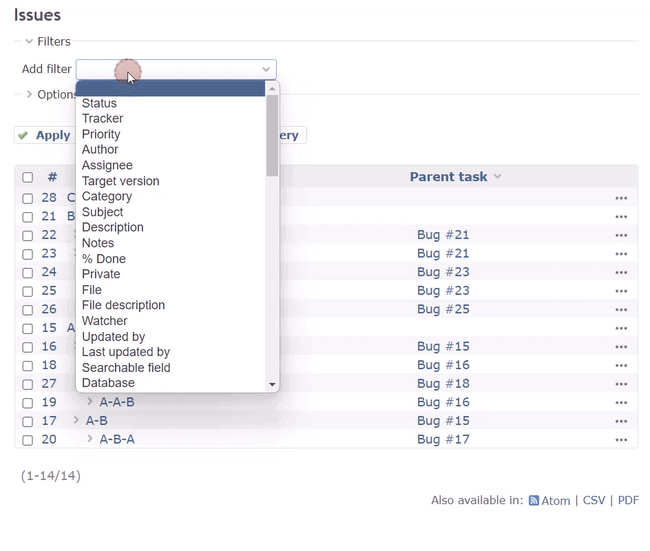

# Redmine Issue Hierarchy Filter
[](https://github.com/sk-ys/redmine_issue_hierarchy_filter/actions/workflows/test.yml?query=branch%3Amain)

This is a plugin for Redmine that adds issue hierarchy filter.

## Features

- Calculate issue levels based on parent-child relationships
- Filter issues based on their levels
- Automatically update levels when issues are added, updated, or deleted

## Installation
### 1. Download
#### When using git
Clone this repository to your Redmine plugins directory.
```
cd [YOUR_REDMINE_DIRECTORY]/plugins
git clone https://github.com/sk-ys/redmine_issue_hierarchy_filter.git
```

#### When not using git

1. Download zip file from the [release page](https://github.com/sk-ys/redmine_issue_hierarchy_filter/releases) or the [latest main repository](https://github.com/sk-ys/redmine_issue_hierarchy_filter/archive/refs/heads/main.zip).

2. Extract the ZIP file to your Redmine plugins directory. The name of the unzipped directory must be `redmine_issue_hierarchy_filter`.


### 2. Apply the migrations
Run the following command to apply the migrations to add the `issue_level` table:
```
bundle exec rake redmine:plugins:migrate NAME=issue_hierarchy_filter RAILS_ENV=production
```

### 3. Initialize the `issue_level` table
Run the following command to initialize the `issue_level` table:
```
bundle exec rake issue_hierarchy_filter:update_levels RAILS_ENV=production
```
Note: This will calculate the hierarchy levels for all issues. The processing time may vary depending on the number of registered issues.

### 4. Restart Redmine

## Uninstallation
### 1. Reset the migrations
Run the following command to reset the migrations:
```
bundle exec rake redmine:plugins:migrate NAME=issue_hierarchy_filter RAILS_ENV=production VERSION=0
```

### 2. Remove the Plugin Directory
Delete the `redmine_issue_hierarchy_filter` directory from your Redmine plugins directory.

## Usage

Filter issues based on their levels in the issue list view.

